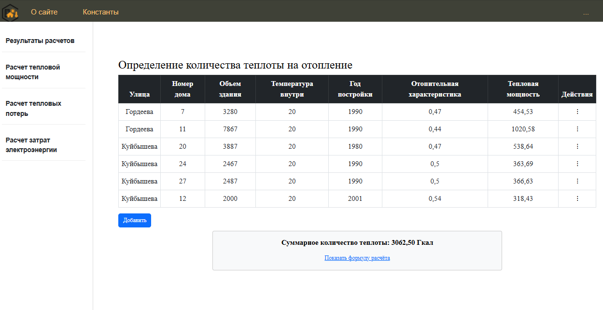
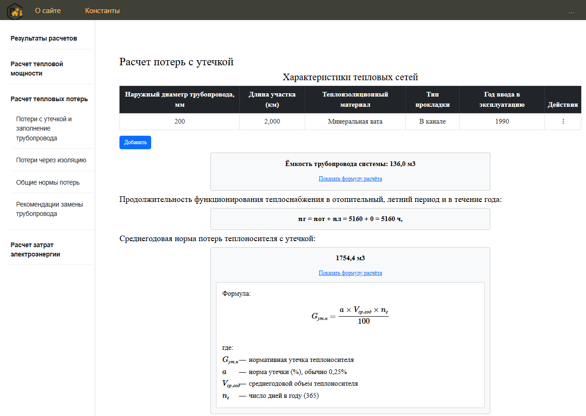
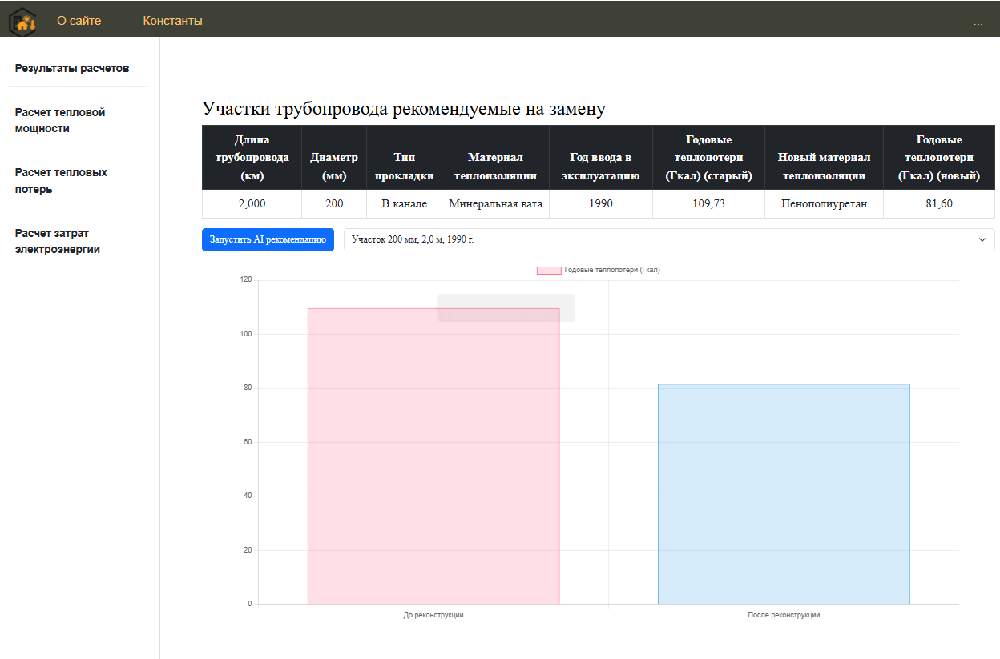

# 🌡️ Система повышения энергоэффективности теплоснабжения

**Веб-приложение для инженерных расчётов, анализа и оптимизации параметров тепловой инфраструктуры.**

## 📌 Описание проекта

Данный проект представляет собой информационно-расчётную систему, разработанную для автоматизации работы с параметрами теплоносителя и трубопроводов. Основная цель — **повышение энергоэффективности** существующих теплосетей за счёт точных расчётов, прозрачного отображения инженерных констант и применения интеллектуальных рекомендаций.

Проект подходит для:
- инженерных расчётов в теплоснабжении;
- сопровождения проектов модернизации теплосетей;
- образовательных и научных целей;
- интеграции с системами умного города и цифрового двойника.

---

## ⚙️ Технологии

- **Язык программирования:** Python 3.10+
- **Фреймворк:** Django 5.x
- **Типизация и валидация данных:** [Pydantic](https://docs.pydantic.dev/)
- **Интерфейс:** HTML5 + Bootstrap 5
- **Хранилище конфигурации:** INI-файл (`constant.conf`)
- **Поддержка расширений:** Возможность подключения ML/AI моделей (рекомендательная система)

---

## 🚀 Функциональность

- 📊 **Отображение инженерных констант** с пояснениями
- 🔧 **Загрузка параметров из файла конфигурации**
- 📈 **Расчёт теплопотерь** с учётом условий прокладки
- 🧠 **Поддержка ИИ-рекомендаций** (опционально)
- 🌐 **Web-интерфейс** для просмотра и возможного редактирования параметров

---

## 📸 Скриншоты

